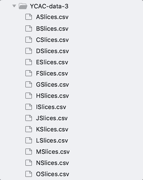
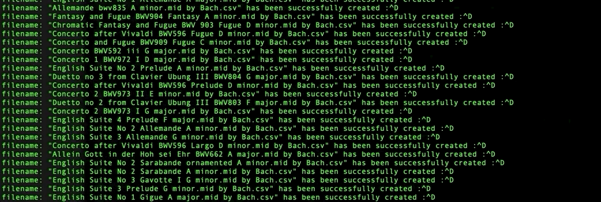

# YCAC-data-splitter
Script allows split and organize YCAC data frame by titles and composers 

## Installing
Please install pip and run command line below in the same directory where 'requirements.txt' exists in order to install packages required to run.
```
$ pip install -r requirements.txt 
```
## Running the tests
Command looks like
```
$ python splitter.py -i directory_name
```
>for example:
```
$ python splitter.py -i YCAC-data-1
```
>Auto dir generator by composer's names
>>

>Generating .csv files by title
>>

## Input & Output
Input
>Link to Yale Classical Archives
>>https://ycac.yale.edu/

Output
>Link to Google drive(private)
>>TBU
